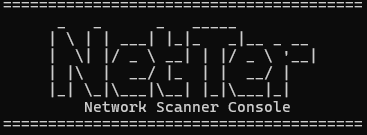

# Network Scanner (C++ / Windows)




Herramienta profesional de diagnóstico de red orientada a operación técnica real: descubrimiento de hosts, latencia ICMP, escaneo TCP con clasificación de estado por puerto y salida estructurada para automatización.

## Resumen Ejecutivo

Este proyecto implementa un scanner de red IPv4 en C++20, diseñado con arquitectura modular y foco en mantenibilidad.  
Está pensado para escenarios de soporte, operaciones, validación post-despliegue y revisión técnica de exposición de servicios internos.

## Capacidades Principales

- Descubrimiento de hosts por red objetivo en formato CIDR.
- Resolución de objetivo manual desde:
  - CIDR (ej. `192.168.1.0/24`)
  - IP única (se normaliza a `/32`)
  - Hostname (se resuelve a IPv4 y se normaliza a `/32`)
- Medición ICMP por host (`icmp_reachable`, `icmp_latency_ms`).
- Escaneo TCP por puerto con estados:
  - `open`
  - `closed`
  - `filtered`
  - `error`
- Modo de ejecución:
  - CLI por argumentos
  - Interactivo (asistente al ejecutar sin argumentos)
- Formatos de salida:
  - `text` para operación diaria
  - `json` para integración con scripts y pipelines

## Arquitectura

Estructura por capas con separación de responsabilidades:

```text
include/network_scanner/
  core/       -> modelos y contrato del scanner
  discovery/  -> resolución de targets e ICMP
  ports/      -> escaneo TCP y estado de puertos
  output/     -> serialización text/json

src/
  main.cpp                    -> CLI + modo interactivo
  core/scanner.cpp            -> orquestación y concurrencia
  discovery/target_resolver.cpp
  discovery/icmp_discovery.cpp
  ports/tcp_port_scanner.cpp
  output/formatter.cpp
```

### Decisiones de Diseño Relevantes

- Concurrencia por workers con distribución dinámica de hosts.
- Detección de host no dependiente solo de ping:
  - un host se considera detectado si responde ICMP **o** tiene algún puerto `open`.
- Modelo de salida explícito con `error_code` por puerto para troubleshooting fino.
- Normalización de puertos por defecto para uso operativo inmediato:
  - `21, 22, 23, 53, 80, 135, 139, 443, 445, 3389`

## Flujo de Ejecución

1. Entrada por CLI o asistente interactivo.
2. Normalización del target (`CIDR/IP/hostname -> CIDR`).
3. Resolución de rango y enumeración de IPs.
4. Escaneo concurrente por host:
   - probe ICMP
   - probe TCP de puertos objetivo
5. Clasificación por puerto (`open/closed/filtered/error`).
6. Filtrado opcional de hosts no detectados (`--all-hosts`).
7. Render de salida (`text` o `json`).

## Requisitos

- Windows (WinSock / IP Helper API)
- CMake 3.20+
- Compilador C++20 (MSVC recomendado)

## Compilación

```powershell
cmake -S . -B build
cmake --build build --config Release
```

Binario generado:

```text
build/Release/network_scanner.exe
```

## Uso

### 1) Modo Interactivo

```powershell
.\build\Release\network_scanner.exe
```

El asistente solicita:
- red automática o target manual
- puertos
- timeouts
- workers
- inclusión de hosts no detectados
- formato de salida

### 2) Modo CLI

```powershell
.\build\Release\network_scanner.exe --help
```

Opciones disponibles:

- `--cidr` objetivo en CIDR, IP o hostname
- `--ports` puertos separados por coma
- `--ping-timeout` timeout ICMP en ms
- `--connect-timeout` timeout TCP en ms
- `--workers` número de hilos
- `--output` `text` | `json`
- `--all-hosts` incluye hosts no detectados como activos

## Ejemplos Profesionales

### Diagnóstico rápido de servicios web internos

```powershell
.\build\Release\network_scanner.exe --cidr 192.168.0.0/24 --ports 80,443 --output text
```

### Validación de host puntual por hostname

```powershell
.\build\Release\network_scanner.exe --cidr localhost --ports 80,443 --output text
```

### Integración con automatización (JSON)

```powershell
.\build\Release\network_scanner.exe --cidr 192.168.0.0/24 --ports 80,443,445,3389 --output json
```

### Escaneo ampliado incluyendo hosts no detectados

```powershell
.\build\Release\network_scanner.exe --cidr 192.168.0.0/24 --all-hosts --output json
```

## Interpretación de Estados de Puerto

- `open`: servicio escuchando y accesible.
- `closed`: host alcanzable pero sin servicio activo en ese puerto.
- `filtered`: timeout o bloqueo intermedio (firewall/ACL/silencio de respuesta).
- `error`: fallo local o de socket no clasificable como estado anterior.


